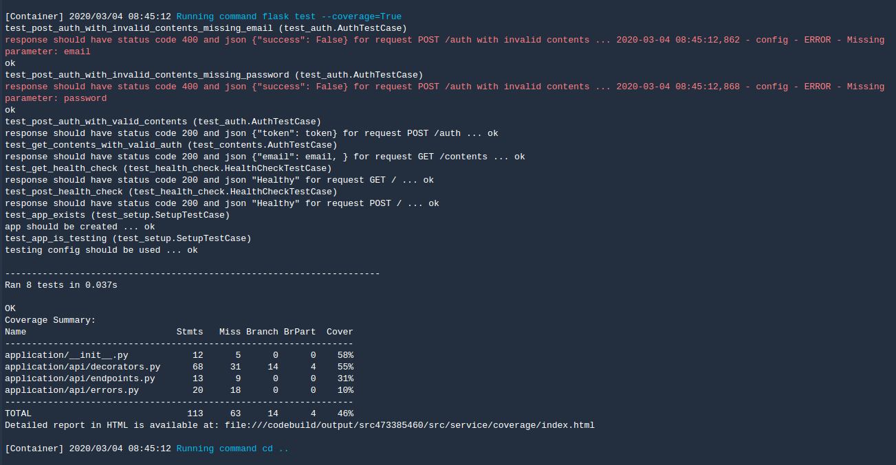
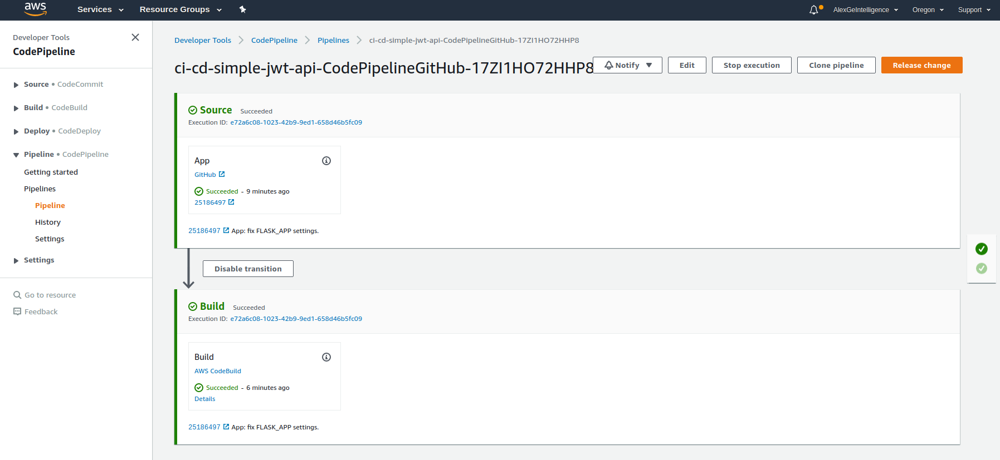

# Udacity Full Stack Development Nanodegree

This is the project for **Containerized Service Deployment on AWS EKS** of Udacity's  Full Stack Development Nanodegree

-- 

## Overview

In this project a Flask API will be containerized and deployed to a Kubernetes cluster using Docker, AWS EKS, CodePipeline, and CodeBuild.

The Flask app has the following three API endpoints

- `GET '/'`: This is a simple health check, which returns the response 'Healthy'. 
- `POST '/auth'`: This takes a email and password as json arguments and returns a JWT based on a custom secret.
- `GET '/contents'`: This requires a valid JWT, and returns the un-encrpyted contents of that token. 
     
---

## Up & Running

### Create a Kubernetes (EKS) Cluster

First, create an EKS cluster using eksctl:
```bash
# install eksctl
curl --silent --location "https://github.com/weaveworks/eksctl/releases/download/latest_release/eksctl_$(uname -s)_amd64.tar.gz" | tar xz -C /tmp
sudo mv /tmp/eksctl /usr/local/bin
# create cluster:
nohup eksctl create cluster --name simple-jwt-api --region us-west-2 & > eks-create-cluster.log
```

### Set Up an IAM Role for the Cluster

The next steps are provided to quickly set up an IAM role for your cluster.

#### Create an IAM role that CodeBuild can use to interact with EKS

The whole operations are packed up inside script [create-iam-role.sh](scripts/create-iam-role.sh)

* Set an environment variable ACCOUNT_ID to the value of your AWS account id. You can do this with awscli:

    ```bash
    ACCOUNT_ID=$(aws sts get-caller-identity --query Account --output text)
    ```

* Create a role policy document that allows the actions "eks:Describe*" and "ssm:GetParameters". You can do this by setting an environment variable with the role policy:

    ```bash
    TRUST="{ \"Version\": \"2012-10-17\", \"Statement\": [ { \"Effect\": \"Allow\", \"Principal\": { \"AWS\": \"arn:aws:iam::${ACCOUNT_ID}:root\" }, \"Action\": \"sts:AssumeRole\" } ] }"
    ```

* Create a role named 'UdacityFlaskDeployCBKubectlRole' using the role policy document:

    ```bash
    aws iam create-role --role-name UdacityFlaskDeployCBKubectlRole --assume-role-policy-document "$TRUST" --output text --query 'Role.Arn'
    ```

* Create a role policy document that also allows the actions "eks:Describe*" and "ssm:GetParameters". You can create the document in your tmp directory:

    ```bash
    echo '{ "Version": "2012-10-17", "Statement": [ { "Effect": "Allow", "Action": [ "eks:Describe*", "ssm:GetParameters" ], "Resource": "*" } ] }' > /tmp/iam-role-policy 
    ```

* Attach the policy to the 'UdacityFlaskDeployCBKubectlRole'. You can do this using awscli:

    ```bash
    aws iam put-role-policy --role-name UdacityFlaskDeployCBKubectlRole --policy-name eks-describe --policy-document file:///tmp/iam-role-policy
    ```

#### Grant the Role Access to the Cluster.

The whole operations are packed up inside script [get-kube-configmap.sh](scripts/get-kube-configmap.sh) and [patch-kube-configmap.sh](scripts/patch-kube-configmap.sh)

The updated config file is available at [aws-auth-patch.yml](scripts/aws-auth-patch.yml)

* Get the current configmap and save it to a file:

    ```bash
    kubectl get -n kube-system configmap/aws-auth -o yaml > /tmp/aws-auth-patch.yml
    ```

* In the data/mapRoles section of this document add, replacing <ACCOUNT_ID> with your account id:

    ```yaml
    mapRoles: |
      - rolearn: arn:aws:iam::112924623848:role/eksctl-simple-jwt-api-nodegroup-n-NodeInstanceRole-CXBRB58CU6J1
          username: system:node:{{EC2PrivateDNSName}}
          groups:
          - system:bootstrappers
          - system:nodes
      - rolearn: arn:aws:iam::112924623848:role/UdacityFlaskDeployCBKubectlRole
          username: build
          groups:
          - system:masters
    ```

* Now update your cluster's configmap:

    ```bash
    kubectl patch configmap/aws-auth -n kube-system --patch "$(cat /tmp/aws-auth-patch.yml)"
    ```

#### Create GitHub Personal Access Tokens

Generate a GitHub access token. A Github acces token will allow CodePipeline to monitor when a repo is changed. You should generate the token with full control of private repositories, as shown in the image below. Be sure to save the token somewhere that is secure.


#### Put Secret into AWS Parameter Store

Save the JWT secret to be used by buildspec.yml in **AWS Systems Manager's Parameter Store**

The whole operations are packed up inside script [create-jwt-secret.sh](scripts/create-jwt-secret.sh)

```bash
aws ssm put-parameter --name JWT_SECRET --value "UdacityFullStackDevelopmentJWTSecret" --type SecureString
```

#### Create CI/CD Pipeline with CloudFormation

After that, create CI/CD pipeline using CloudFormation

* Go the the CloudFormation service in the aws console.
* Press the 'Create Stack' button.
* Choose the 'Upload template to S3' option and upload the template file 'ci-cd-codepipeline.cfn.yml'
* Press 'Next'. Give the stack a name, fill in your GitHub login and the Github access token generated in step 1.
* Confirm the cluster name matches your cluster, the 'kubectl IAM role' matches the role you created above, and the repository matches the name of your forked repo.
* Create the stack.

---

### Testing

#### Endpoints

- `GET '/'`: http://a367682165def11eabc7606274191f92-240447169.us-west-2.elb.amazonaws.com/api/v1/ 

    ```bash
    # cURL test
    curl http://a367682165def11eabc7606274191f92-240447169.us-west-2.elb.amazonaws.com/api/v1/
    ```

- `POST '/auth'`: http://a367682165def11eabc7606274191f92-240447169.us-west-2.elb.amazonaws.com/api/v1/auth
- `GET '/contents'`: http://a367682165def11eabc7606274191f92-240447169.us-west-2.elb.amazonaws.com/api/v1/contents 

    ```bash
    # cURL test
    export TOKEN=`curl -d '{"email":"email","password":"password"}' -H "Content-Type: application/json" -X POST  http://a367682165def11eabc7606274191f92-240447169.us-west-2.elb.amazonaws.com/api/v1/auth  | jq -r '.token'`
    curl --request GET http://a367682165def11eabc7606274191f92-240447169.us-west-2.elb.amazonaws.com/api/v1/contents -H "Authorization: Bearer ${TOKEN}" | jq 
    ```

#### Flask Unittest Cases

First, the flask unittest covers all the 3 endpoints. See the test cases inside [Flask tests](service/tests)

The test results and coverage analysis on AWS CodePipeline is shown in the following picture



#### CI/CD Pipeline Status

The final status of AWS CodePipeline is shown in the picture below




